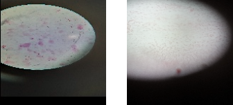

# EcoFilter

This project performs image classification using VGG16 for feature extraction and XGBoost for classification, with image registration as a preprocessing step.

## Features
- Image registration using skimage’s `register_translation`.
- Feature extraction with pre-trained VGG16.
- Classification with XGBoost.
- Visualization of confusion matrix and image registration results.

## Installation
1. Clone the repository:
   ```bash
   git clone https://github.com/AmirFeiz2001/EcoFilter.git
   cd EcoFilter

2. Install dependencies:
   ```bash
   pip install -r requirements.txt

## Usage
Run the pipeline with:
   ```bash
   python main.py --dataset /path/to/images.npy --labels /path/to/labels.npy --output_dir /path/to/output
   ```

## Samples of the Microscopic images

